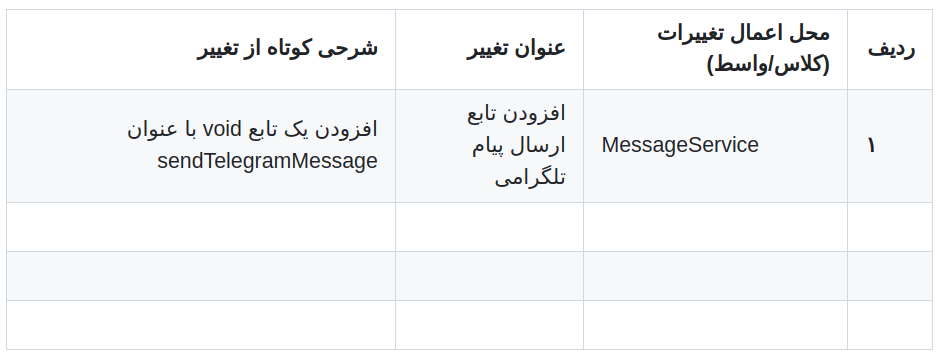
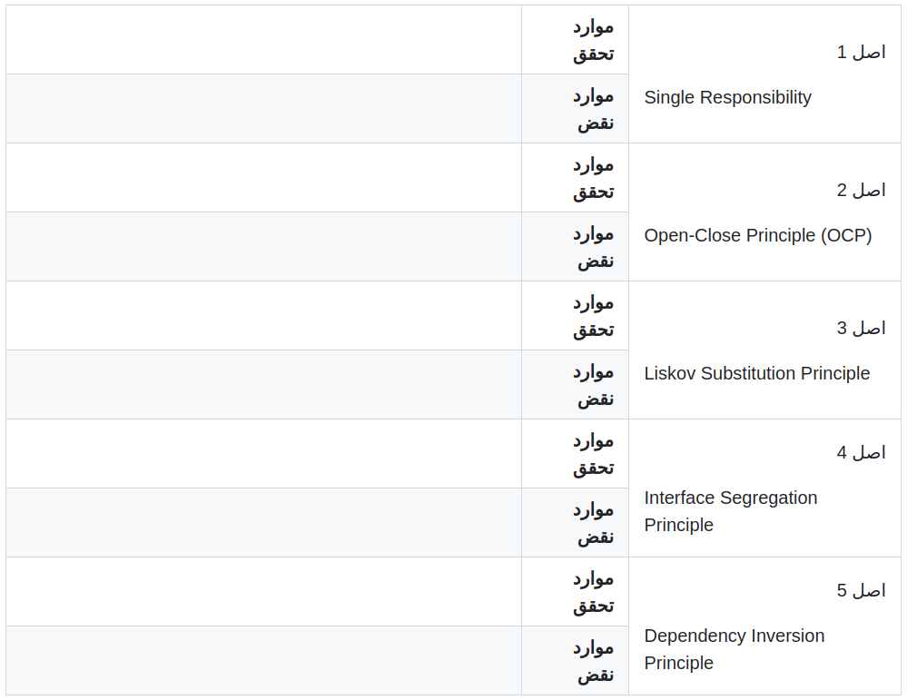
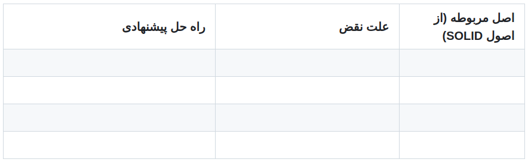

# پیام‌رسان قزمیت

## اهداف

در این آزمایش دانشجویان با اصول شی‌گرایی با تاکید بر اصول SOLID آشنا می‌شوند:

- اصول برقراری اصول SOLID
- عواقب نقض اصول SOLID
- ارائه راهکار برای برقراری اصول شی‌گرایی و اعمال آن راهکار بر روی کد
- درک عمیق مزایای به کارگیری اصول شی‌گرایی

## پیش‌نیازهای این آزمایش

- آشنایی با زبان جاوا و نصب JDK و یک ادیتور مناسب برای جاوا

## شرح آزمایش

### شرح برنامه

در این آزمایش، کد یک پیام‌رسان به شما داده شده است که کار آن، ارائه سرویس ارسال پیام به روش‌های مختلف و در قالب یک برنامه است. در این برنامه (که صرفاً یک شبیه‌سازی از چنین سیستمی است) در ابتدا روش ارسال پیام (ایمیل و پیامک) انتخاب می‌شود و سپس متن پیام دریافت شده و در صورت صحیح بودن اطلاعات مبدا و مقصد (بررسی صحت این موضوع، به روش ارسال پیام وابسته است)، پیام را ارسال می‌کند. در این آزمایش قصد داریم روش سوم ارسال پیام با استفاده از تلگرام را اضافه نماییم که شناسه (ID) و یا شماره تماس مبدا و مقصد را دریافت کرده و در صورت صحیح بودن آن، اقدام به ارسال پیام نماید. برای این منظور، مراحل زیر را طی نمایید.

## آماده‌سازی

1. **اول**: در ابتدا پروژه پایه را از ریپوزیتوری زیر دریافت کنید و بر روی سیستم (با جاوای ورژن 8) اجرا کنید.  
   [لینک ریپوزیتوری](https://github.com/ssc-public/Software-Engineering-Lab/tree/main/base-projects/MessageSendingPractice)
2. **دوم**: قالب جداول لازم را برای نوشتن گزارش در Git از لینک زیر دریافت کنید.  
   [لینک قالب جداول](https://github.com/ssc-public/Software-Engineering-Lab/blob/main/courseworks/experiments/SOLID.md)

## مراحل انجام آزمایش

برای انجام آزمایش، مراحل زیر را طی کرده و حاصل کار را در گیت‌هاب بارگزاری کنید. (ریپوزیتوری عمومی)

### مرحله اول

در اولین مرحله، بدون آن که هیچ‌گونه تغییری در جاهایی از کد بدهید، سعی کنید یک کلاس `TelegramMessage` با دو متد زیر پیاده‌سازی کنید (به سایر سرویس‌ها نگاه کنید تا ایده بگیرید):

- متدی برای صحت‌سنجی اطلاعات مبدا و مقصد (آیدی یا شماره تماس)
- متدی برای ارسال پیام پس از صحت‌سنجی

کلاس شما باید حتماً از واسط `MessageService` ارث‌بری کند. پروژه را به صورت جداگانه و در قالب یک پوشه به نام `Step-01-without-solid` در ریپوزیتوری گروه خود اضافه کنید.

### مرحله دوم

تمامی تغییراتی را که در پروژه (در اثر مرحله قبلی) در کد اصلی پروژه دادید، در جدول اول بنویسید. این تغییرات شامل افزودن کلاس، افزودن تابع و تغییر در متن توابع موجود است. سپس، تعداد تغییرات مورد نیاز را نیز بنویسید.

### مرحله سوم

بر اساس تغییرات حاصله و جدول مرحله قبلی، موارد تحقق و نقض اصول SOLID را (به جز اصل Single Responsibility) برای پروژه بنویسید. توجه کنید که برای ارزیابی این بخش، صرفاً کلاس‌های بسته `Services` و کلاس `Main` را در نظر بگیرید.

### مرحله چهارم

برای برقراری هرکدام از اصول نقض شده، راه‌حل ارائه دهید تا آن اصل برقرار شود. اصول نقض شده را به همراه علت نقض و راهکار پیشنهادی، در جدول بعدی درج فرمایید.

### مرحله پنجم

موارد نوشته شده در جدول قبل را بر روی کد مرحله اول اعمال کنید و کد جدید را به صورت مجزا در یک پوشه دیگر به نام `step2-with-solid` در ریپوزیتوری گروه خود بارگزاری کنید. توجه کنید که تمامی موارد گفته شده در جدول راهکار پیشنهادی باید در کد شما دیده شود.

## سوالات پایانی

پاسخ سوالات زیر را در پایان گزارش به صورت جداگانه بنویسید.

1. اگر اصول شی‌گرایی از ابتدا برقرار بود و شما سرویس جدید را به پروژه اضافه می‌کردید، چند مورد از تغییرات ثبت شده در جدول مرحله دوم حذف می‌شد؟ و در نهایت با چند تغییر در سطح کد، این سرویس اضافه می‌شد؟ (عدد آن را حتماً اعلام کنید.)
2. با توجه به آنچه که انجام دادید، در دو خط توضیح دهید که رعایت اصول شی‌گرایی، چه مزایایی را برای پروژه شما فراهم می‌کند؟

## خروجی‌های مورد درخواست
- خروجی شما باید یک ریپوزیتوری عمومی گیت‌هاب باشد که در آن، دو پوشه حاوی پروژه باشد (خروجی مراحل اول و پنجم).
- جداول و پاسخ سوالات پایانی باید در قالب `README` و به زبان فارسی، در همان ریپوزیتوری قابل مشاهده باشد.
